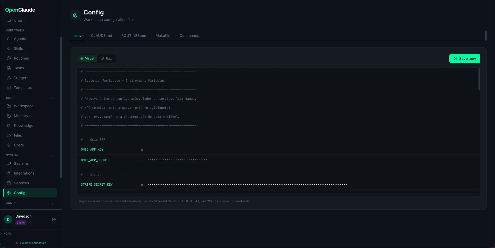

# .env Editor

The dashboard includes a built-in editor for the `.env` file, accessible from **Config** in the sidebar. This lets you manage API keys and integration settings without touching the terminal.



Requires the `config:manage` permission (admin role by default).

## Two Editing Modes

### Visual Mode (default)

Displays the `.env` file as a structured form:
- Each `KEY=VALUE` pair is shown as a labeled input field
- Comments and section headers are preserved as-is
- Empty values are highlighted so you can spot missing keys

To edit a value, click the field, type the new value, and click **Save**.

### Raw Mode

A plain text editor showing the full `.env` file contents. Use this when you need to:
- Add new variables not in the template
- Rearrange sections
- Bulk-paste multiple keys at once

Toggle between modes using the **Visual / Raw** switch at the top of the editor.

## How Secrets Are Masked

In Visual mode, values for sensitive keys are masked by default (shown as `*****`). The masking applies to keys matching common patterns:

- `*_TOKEN`
- `*_SECRET`
- `*_SECRET_KEY`
- `*_PASSWORD`
- `*_API_KEY`

Click the eye icon next to a field to reveal the actual value. The raw value is always sent to the backend when saving -- masking is a frontend-only display feature.

In Raw mode, all values are shown in plain text.

## Saving and Reloading

When you save changes:

1. The backend writes the new content to the `.env` file on disk
2. `python-dotenv` reloads the variables into the running Flask process (`load_dotenv(override=True)`)
3. The change is recorded in the **Audit Log** with the acting user

This means **changes take effect without restarting the dashboard**. The Flask process picks up new values immediately.

However, note that:
- **Running routines** use their own process -- they read `.env` at execution time, so new values apply on the next run
- **The scheduler** reads `.env` when it spawns each routine, so changes are picked up automatically
- **MCP servers** configured in `.claude/settings.json` may need a Claude Code restart to pick up new environment variables

## Example Workflow

1. Go to **Config > .env** in the dashboard
2. Find `DISCORD_BOT_TOKEN` in the Discord section
3. Click the masked field, paste your token
4. Click **Save**
5. Run `make community` to test -- it will use the new token

## Structure of the .env File

The `.env` file follows a sectioned layout generated by `make setup`:

```env
# -- Stripe -----------------------------------------------
STRIPE_SECRET_KEY=sk_live_...

# -- Discord -----------------------------------------------
DISCORD_BOT_TOKEN=your_token
DISCORD_GUILD_ID=your_guild_id

# -- Telegram -----------------------------------------------
TELEGRAM_BOT_TOKEN=your_token
TELEGRAM_CHAT_ID=your_chat_id
```

The editor preserves comments and blank lines, so sections stay organized after edits.

## API Reference

The `.env` editor uses two endpoints:

```
GET  /api/config/env    -- returns {entries: [...], raw: "..."}
PUT  /api/config/env    -- accepts {entries: [...]} or {raw: "..."}
```

Both require authentication and `config:manage` permission.
